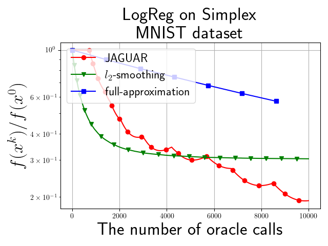

| Название исследуемой задачи | Аппроксимации градиента с помощью оракула нулевого порядка и техники запоминания |
| :---: | :---: |
| Тип научной работы | Выпускная квалификационная работа |
| Автор | Богданов Александр Иванович |
| Научный руководитель | к.ф.-м.н. Безносиков Александр Николаевич |

# Аннтотация

В данной работе рассматривается проблема оптимизации <<черного ящика>>. В такой постановке задачи нет доступа к градиенту целевой функции, поэтому его необходимо каким-либо образом оценить. Предлагается новый способ аппроксимации градиента $\texttt{JAGUAR}$, который запоминает информацию из предыдущих итераций и требует $\mathcal{O}(1)$ обращений к оракулу. Эта аппроксимация адаптирована для алгоритма Франка-Вульфа, в частности доказана сходимость для выпуклой постановки задачи. Анализируются как детерминированная постановка задачи минимизации, так и стохастическая на выпуклом ограниченном множестве $Q$ с шумом в оракуле нулевого порядка, такая постановка довольно непопулярна в литературе. Но было доказано, что $\texttt{JAGUAR}$ является робастной и в таком случае. Проведенные эксперименты показывают, что $\texttt{JAGUAR}$ превосходит уже известные в литературе методы оценки градиента.

# Установка

Чтобы повторить результаты вычислительного эксперимента, рекомендуется установить все необходимые зависимости.
Файл ``requirements.txt`` находится в директории ``code``.
Для установки

- Сделайте ``git clone`` этого репозитория.
- Создайте новое ``conda`` окружение и активируйте его.
- Запустите ``pip install -r requirements.txt``.

# Содержание

В этом репозитории представлен код, написанный в рамках выпускной квалификационной работы. Если вы запустите [L1.ipynb](https://github.com/intsystems/Bogdanov-BS-Thesis/blob/main/code/experiments/L1.ipynb), [L2.ipynb](https://github.com/intsystems/Bogdanov-BS-Thesis/blob/main/code/experiments/L2.ipynb) и [Simplex.ipynb](https://github.com/intsystems/Bogdanov-BS-Thesis/blob/main/code/experiments/Simplex.ipynb) в каталоге кода, то воспроизведете экспериментальные результаты, полученные в работе.  

