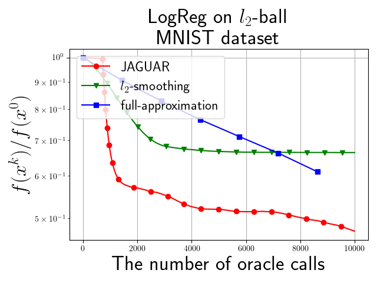
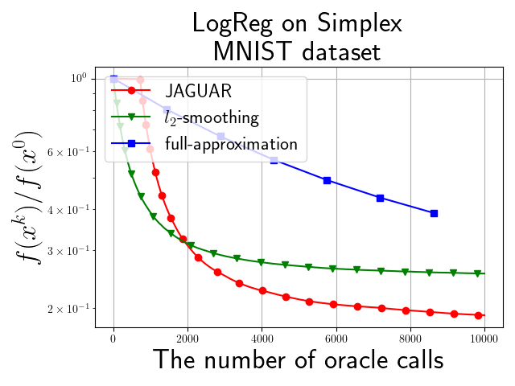

| Название исследуемой задачи | Аппроксимации градиента с помощью оракула нулевого порядка и техники запоминания |
| :---: | :---: |
| Тип научной работы | Выпускная квалификационная работа |
| Автор | Богданов Александр Иванович |
| Научный руководитель | к.ф.-м.н. Безносиков Александр Николаевич |

# Аннтотация

В данной работе рассматривается проблема оптимизации <<черного ящика>>. В такой постановке задачи не имеется доступа к градиенту целевой функции, поэтому его необходимо как-то оценить. Предлагается новый способ аппроксимации градиента $\texttt{JAGUAR}$, который запоминает информацию из предыдущих итераций и требует $\mathcal{O}(1)$ обращений к оракулу. Эта аппроксимацию реализована для алгоритма Франка-Вульфа и для него доказана сходимость для выпуклой постановки задачи. Помимо детерминированной постановки рассматривается и стохастическая задача минимизации на множестве $Q$ с шумом в оракуле нулевого порядка, такая постановка довольно непопулярна в литературе, но я было доказано, что $\texttt{JAGUAR}$ является робастной и в таком случае. Проведены эксперименты по сравнению оценщика градиента $\texttt{JAGUAR}$ с уже известными в литературе и подтверждено его доминирование.

# Установка

1. `git clone` этот репрезиторий.
2. Создайте новое окружение `conda` и активируйте его
3. Запустите 
```bash
pip install -r requirements.txt
pip install ipykernel
python -m ipykernel install --user --name <env_name> --display-name <env_name>
```

# Содержание

В этом репозитории представлен код, написанный в рамках выпускной квалификационной работы. Если вы запустите [L1.ipynb](https://github.com/intsystems/Bogdanov-BS-Thesis/blob/main/code/experiments/L1.ipynb), [L2.ipynb](https://github.com/intsystems/Bogdanov-BS-Thesis/blob/main/code/experiments/L2.ipynb) и [Simplex.ipynb](https://github.com/intsystems/Bogdanov-BS-Thesis/blob/main/code/experiments/Simplex.ipynb) в каталоге кода, то воспроизведете экспериментальные результаты, полученные в работе.  



